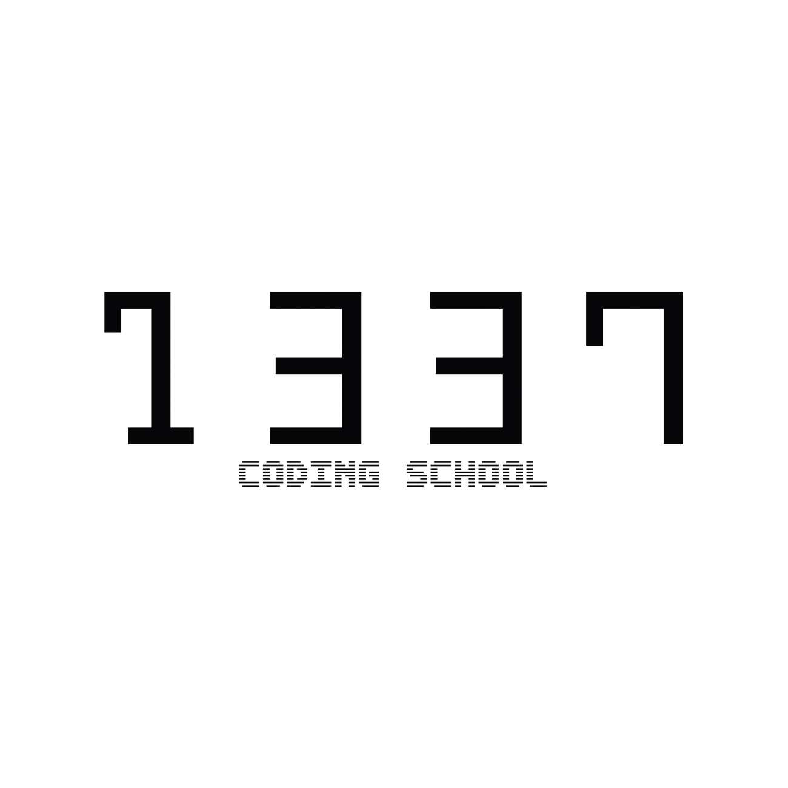

# 42cursus💻

## INFO👷

**begin date : 1/nov/2021 🎉**

## Project List
### Common Circle

| CIRCLE | PROJECT | P.L | TOPICS | EXPERIENCE | STATUS | COMPLETION | DOCUMENTS |
| :----: | -------- | ---------- | ------ | ------------------ | -------- | ------ | ------ |
|	00	|	[Libft](https://github.com/NajmiAchraf/Libft/tree/6dc22a9394736760322b70a53903e276faea31ae)	|	C	|	`Library` `Mikefile` `Linked list`	|	462 XP	|		|	21-11-2021	|	[fr subject Libft](./Subjects/fr.subject.Libft.pdf)	|
|	01	|	[ft_printf](https://github.com/NajmiAchraf/ft_printf/tree/001ad1eb375ff0d9d3a804961c307b4ce5e6a0f1)	|	C	|	`variadic arguments` `character parsing` `unicode encoding` `BigInt` `Library` `Makefile`	|	882 XP	|		|	29-11-2021	|	[fr subject ft_printf](./Subjects/fr.subject.ft_printf.pdf)	|
|	01	|	[get_next_line](https://github.com/NajmiAchraf/get_next_line/tree/c61f30b1c2129e628578ef61cb19ad21da5db726)	|	C	|	`file descriptor`	|	882 XP	|	 |	05-12-2021	|	[en subject GetNextLine](./Subjects/en.subject.GetNextLine.pdf)	|
|	01	|	Born2beroot	|		| `virtual machine` `linux` `Debian`  `sudo` `ssh` `ufw` |	577 XP	|		|	13-12-2021	|	[fr subject Born2beRoot](./Subjects/fr.subject.Born2beRoot.pdf)	|
|	02	|	Exam Rank 02	|		| `union`  [ft_printf](https://github.com/NajmiAchraf/ft_printf/tree/001ad1eb375ff0d9d3a804961c307b4ce5e6a0f1) |	0 XP	|		|	17-12-2021	|		|
|	02	|	[fract'ol](https://github.com/NajmiAchraf/fract-ol/tree/4eb38f090e82451f80e0161af1a678d380b59596)	| C | `GUI` `fractal` |	1000 XP	|		|	13-03-2022	| [fr subject fract'ol](./Subjects/fr.subject.fract-ol.pdf) [en subject fract'ol](./Subjects/en.subject.fract-ol.pdf) |
|	02	|	[minitalk](https://github.com/NajmiAchraf/minitalk/tree/cdd40fdc3d58a9b0d8186b6da1bc9a027b32b8b2)	| C    | `signals` `bits` |	1142 XP	|		|	18-02-2022	| [fr subject minitalk](./Subjects/fr.subject.minitalk.pdf) [en subject minitalk](./Subjects/en.subject.minitalk.pdf) |
|	02	|	[push_swap](https://github.com/NajmiAchraf/push_swap/tree/ef382fbe6a3cbce63e6a594dbc5cc50d664b2ddb)	| C | `sorting` |	1855 XP	|		|	18-03-2022	| [en subject Push_Swap](./Subjects/en.subject.Push_Swap.pdf) |
|	03	|	Philosophers	| C | `threading` |	3360 XP	|		| 15-04-2022 | [fr subject Philosophers](./Subjects/fr.subject.Philosophers.pdf) |
|	03	|	Exam Rank 03	| C | [get_next_line](https://github.com/NajmiAchraf/get_next_line/tree/c61f30b1c2129e628578ef61cb19ad21da5db726) |	0 XP	|		| 18-05-2022 | |
|	03	|	Minishell	| C | `bash``multiple proccess``multiple pipes` |	2814 XP	|		| 04-10-2022 | [en subject Minishell](./Subjects/en.subject.minishell.pdf) |
